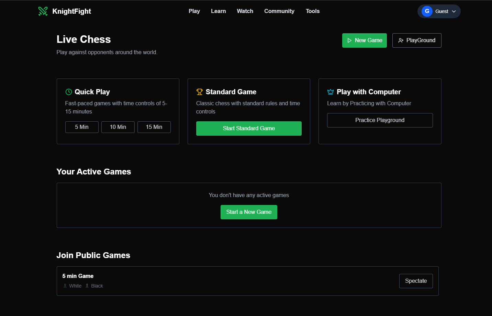
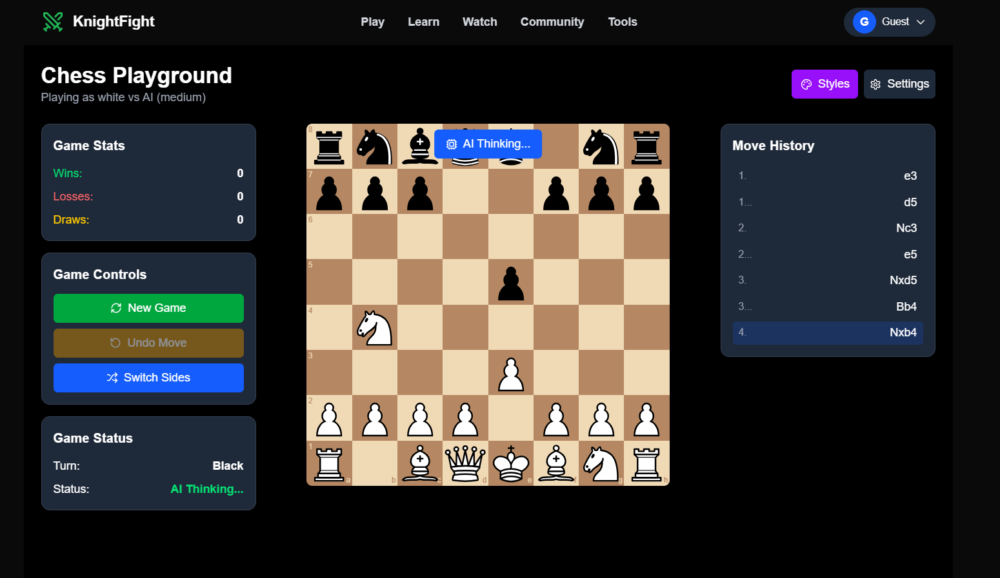
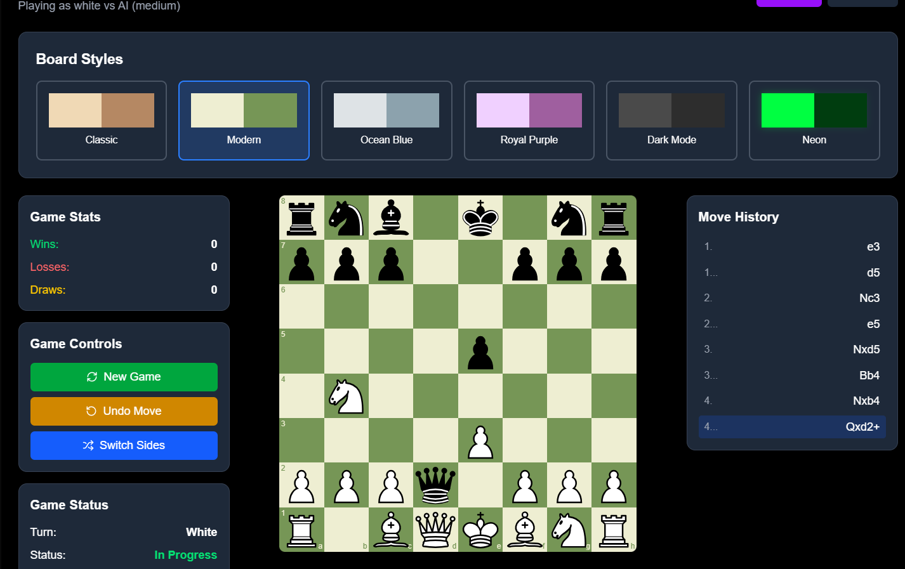
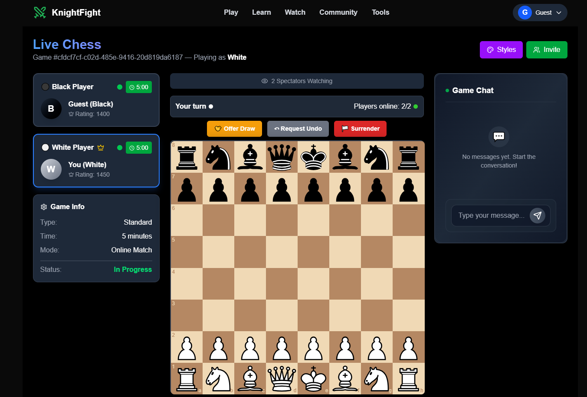
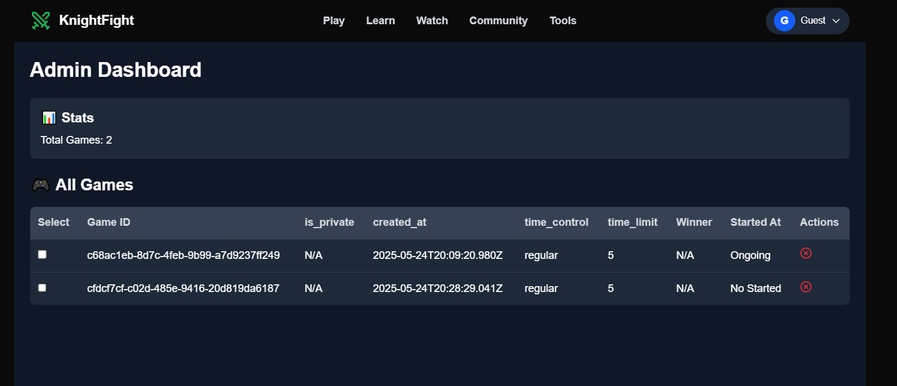

# ♞ KnightFight

A modern, full-stack, real-time multiplayer **chess platform** that supports playing with friends, spectators, live chat, computer opponents (with difficulty levels), move tracking (FEN & PGN), and much more — all built with **Next.js, Express, PostgreSQL, and Socket.IO**.

🌐 **Live Site:** [knightfight.vercel.app](https://knightfight.vercel.app)  
📡 **Backend Server:** [knightfight-server.onrender.com](https://knightfight-server.onrender.com)

---

## 🖼️ Preview

Here are some preview screenshots of **KnightFight**:






<p align="center">
  
  
</p>
<p align="center">
  
  
</p>

## 🎯 Features

- ✅ **Guest Play Only** – Jump into the game instantly without signing in
- ♟️ **Play with Computer** – Choose difficulty: Easy, Medium, Hard, or Random
- 🆚 **Multiplayer Matchmaking** – Create & share a game link to invite a friend
- 👀 **Spectator Mode** – Let others watch your live game in real-time
- 💬 **Live Chat** – Chat with your opponent during the game
- 📜 **Move History** – Track each move in real time
- 📥 **Export** – Download your games as FEN or PGN
- 🧩 **Custom Board Styles** – Choose from multiple chessboard themes
- ⚡ **Real-Time Communication** – Powered by Socket.IO
- 🔐 **Secure & Scalable Backend** – PostgreSQL with Express.js

---

## 🛠️ Tech Stack

### Frontend

- [Next.js 15](https://nextjs.org/)
- [React](https://reactjs.org/)
- [Tailwind CSS](https://tailwindcss.com/)
- [chessboardjsx](https://github.com/willb335/chessboardjsx)
- [chess.js](https://github.com/jhlywa/chess.js)

### Backend

- [Node.js](https://nodejs.org/)
- [Express](https://expressjs.com/)
- [Socket.IO](https://socket.io/)
- [PostgreSQL](https://www.postgresql.org/)
- [Sequelize](https://sequelize.org/)

---

## 🚀 Getting Started

### 1. Clone the repository

```bash
git clone https://github.com/PRATHAMU200/knightfight.git
cd knightfight
```

### 2. Install dependencies

```bash
npm install
```

### 3. Setup environment variables

Create a `.env.local` file in the root directory for the frontend, and a `.env` file in the `server/` directory.

**Frontend (`.env.local`):**

```env
NEXT_PUBLIC_SERVER_URL=https://knightfight-server.onrender.com
```

**Backend (`server/.env`):**

```env
DATABASE_URL=your_postgres_connection_string
PORT=4000
```

### 4. Run the development servers

#### Frontend:

```bash
npm run dev
```

#### Backend (from `server/` folder):

```bash
cd server
npm install
npm run dev
```

---

## 📁 Folder Structure

```
knightfight/
├── app/                 # Next.js app directory
├── components/          # React components
├── public/              # Static assets
├── server/              # Express backend with PostgreSQL
├── styles/              # Tailwind and global styles
├── utils/               # Utilities and helpers
└── README.md
```

---

## 📌 Roadmap

- [ ] Authentication system (Login/Register)
- [ ] Player stats, ranking & ELO
- [ ] Game replay and analysis
- [ ] Voice chat during matches
- [ ] Admin dashboard for moderation
- [ ] Tournaments and leaderboard

---

## 🤝 Contributing

Contributions are welcome! Open an issue or create a pull request. Let's build a better chess world together 🧠

---

## 👤 Author

**Pratham Upadhyay**

- 🌐 [Portfolio](https://iampratham.vercel.app)
- 🐙 [GitHub](https://github.com/prathamu200)

---

## 📄 License

This project is licensed under the MIT License.
